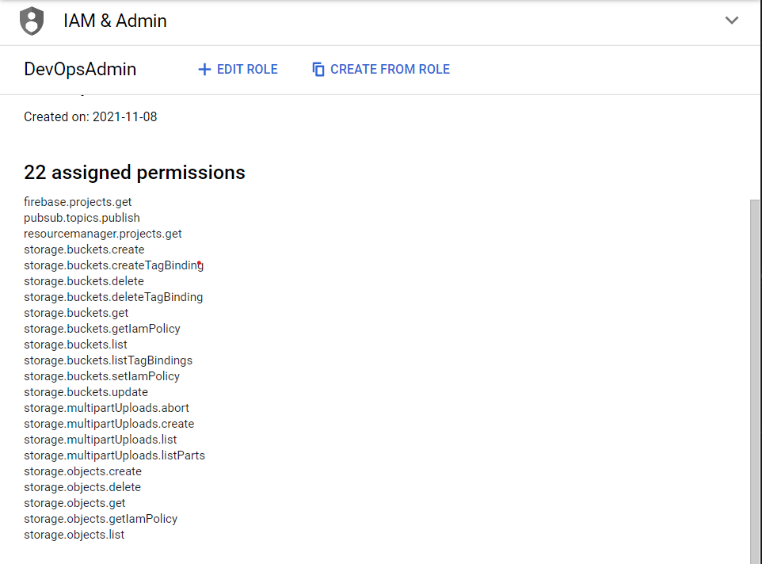
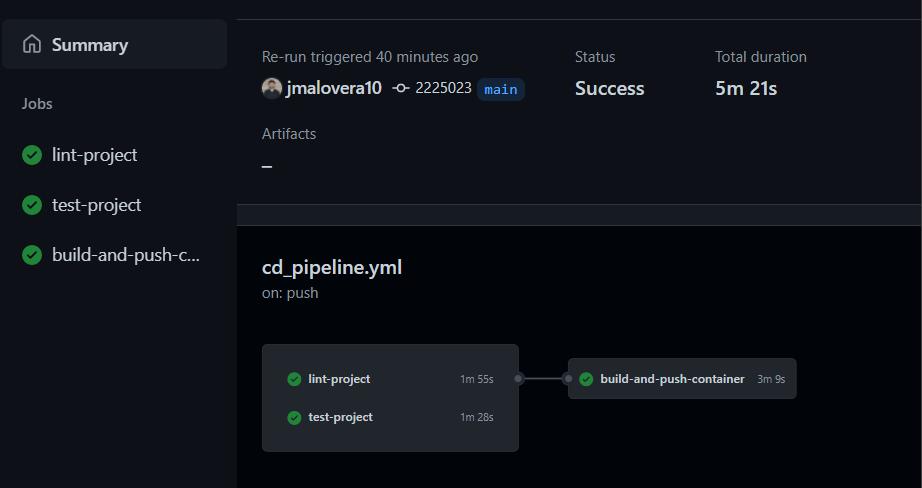

# Develop a CD Pipeline

In this exercise you will develop a CD pipeline that will build a Docker image from a Dockerfile and push it to a Docker registry in GCP. Then you will use this image to deploy a virtual machine that will execute de Kedro pipeline every 5 minutes.

## Objectives

- Build a Kedro Docker image
- Run and verify the image locally
- Add a container building step to the DevOps pipeline
- Add a container publish step to the DevOps pipeline
- Declare infrastructure as code (IaaC) using Terraform
- Declare infrastructure parameters
- Create a service account with IAM permissions for deployment
- Add a deployment step to the DevOps pipeline

## Prerequisites

If you intend to replicate this exercise as it is, I encourage you to [fork](https://docs.github.com/en/get-started/quickstart/fork-a-repo) this repo to your account.

It is necessary that you have [Docker](https://docs.docker.com/engine/install/) installed in your device and that you have a [GCP account](https://cloud.google.com/).

To develop this exercise you should have done the [setup steps in the README.md](../../README.md). It is also advisable that you do the [first exercise](ci_pipeline.md) before beginning this exercise so you may have more clarity about the DevOps pipeline structure. To begin, you must **checkout to the exercise branch named** `exercises/02-cd-pipeline` using

```
git checkout exercises/02-cd-pipeline
```

## Exercise 1: Build and publish a Kedro Docker image

### 1.1: Change Application logic

Add the following catalogs to your `conf/base/catalog.yml` file

```yaml
pokeapi:
  type: api.APIDataSet
  url: https://pokeapi.co/api/v2/pokemon
  params:
    limit: 100000
    offset: 0
    format: json

pokemons:
  type: pandas.ParquetDataSet
  filepath: data/01_raw/pokemons.parquet
```

Then add the following code to your `src/kedro_devops/pipelines/data_engineering/nodes/transform_uppercase.py` file

```python
import pandas as pd
from requests import Response


def transform_uppercase(data_set: Response) -> pd.DataFrame:
    """
    Transform a lowercase dataframe to uppercase.

    Args:
        data_set (APIDataSet): A raw api request

    Returns:
        pd.DataFrame: An uppercase dataframe
    """
    json_data = data_set.json()
    pokemons = json_data.get("results")
    data = pd.json_normalize(pokemons)
    return data.applymap(lambda x: x.upper())

```

This will process the [pokemon api](https://pokeapi.co/) data and transform it to uppercase. After this, we need to add a node to our pipeline that uses the modified `transform_uppercase` function and the catalogs that we added to the `conf/base/catalog.yml` file. To do this we need to open the `src/kedro_devops/pipelines/data_engineering/pipeline.py` file and add the following code:

```python
...
def create_pipeline(**kwargs) -> Pipeline:
    """
    Create a pipeline for data engineering.

    Returns:
        Pipeline: the data engineering pipeline.
    """
    return Pipeline([
        Node(
            transform_uppercase,
            inputs="pokeapi",
            outputs="pokemons",
            name="pokemons_uppercase")
    ])
```

Since the logic of our application has changed, the current test are no longer valid, you can verify this by running `kedro test`. Hence, we need to add the following tests to our `src/tests/pipelines/data_engineering/nodes/test_transform_uppercase.py` file:

```python
...

class TestTransformUppercase:
    def test_transform_string(self, monkeypatch: MonkeyPatch):
        """
        should return a upper case string for a string dataframe
        """

        def mock_json():
            return {
                "results": [{"data": "test1"}, {"data": "test2"}, {"data": "test3"}]
            }

        t_dataframe = Response()
        monkeypatch.setattr(t_dataframe, "json", mock_json)

        output = transform_uppercase(t_dataframe)

        assert output.equals(pd.DataFrame({"data": ["TEST1", "TEST2", "TEST3"]}))

```

This test will mock the response that we get from the API and check if the dataframe is equal to the expected one.

### 1.2: Configure Requirements

Now that we have our pipeline, we need to add the following dependency to `src/requirements.in` to allow us to build and run the image locally.

```properties
...
kedro-docker
...
```

Then build and install the requirements using:

```bash
kedro build-reqs
pip install -r src/requirements.txt
```

### 1.3: Generate a Dockerfile

Generate a `Dockerfile` using the following command:

```bash
kedro docker init
```

Modify the `Dockerfile` in the root directory of the project to look like this

```dockerfile
# BUILD STAGE
FROM python:3.7-buster as builder
WORKDIR /home/kedro

# install project requirements
RUN pip install --no-cache-dir --upgrade pip
COPY ./src .

RUN pip install --no-cache-dir pip-tools && \
    pip-compile requirements.in --output-file requirements.txt && \
    python setup.py clean --all bdist_wheel


# RUN STAGE
FROM python:3.7-buster as runner

# install cron dependencies
RUN apt-get -y update && \
    apt-get -y upgrade && \
    apt-get install -y cron

# install build whl file
COPY --from=builder /home/kedro/dist/kedro_devops-0.1-py3-none-any.whl /tmp/kedro_devops-0.1-py3-none-any.whl
RUN pip install --no-cache-dir --upgrade pip && pip install --no-cache-dir /tmp/kedro_devops-0.1-py3-none-any.whl

# add kedro user
WORKDIR /home/kedro

# copy necessary files
COPY . .

# add execution permissions to execution script
RUN chmod +x executor.sh && touch conf/local/credentials.yml

# add cron job to run kedro every minute
RUN echo "* * * * * root bash /home/kedro/executor.sh >> /home/kedro/cron_logs.log 2>&1" >> /etc/crontab

# configure cron job log file
RUN touch /var/log/cron.log

# run the cron as entrypoint
CMD ["cron","-f"]

```

### 1.4: Building a Docker Image

Then build a container using the following command:

```bash
kedro docker build
```

### 1.5: Running a Docker Image Locally

After the container is built, we can run it locally using the Docker interface or by using the following command:

```bash
docker run -d --name kedro_devops kedro-devops
```

If you want to debug your running container you can do it from the Docker interface or by executing this command:

```bash
docker exec -it kedro_devops /bin/bash
```

### 1.6: Adding a Docker Build and Push Step in the Pipeline

Now that we verified that our container is up and running, we can add a step to our pipeline to build and push the container to our Docker registry. First we need to split our `.github/workflows/pipeline.yml` in two files: one to make CI for all branches except for `main` and another that makes CI and CD for our `main` branch. First we will rename the `.github/workflows/pipeline.yml` file to `.github/workflows/ci_pipeline.yml` and modify the content as follows:

```yaml
name: Continuous Integration Pipeline
on:
  push:
    branches:
      - "*"
      - "!main"
jobs:
  lint-project:
    runs-on: ubuntu-latest
    steps:
      - uses: actions/checkout@v2
      - uses: s-weigand/setup-conda@v1
        with:
          python-version: 3.7.9
      - name: Install pip-tools
        run: pip install pip-tools
      - name: Install dependencies
        run: |
          pip-compile src/requirements.in --output-file src/requirements.txt
          pip install -r src/requirements.txt
      - name: Run linting
        run: kedro lint

  test-project:
    runs-on: ubuntu-latest
    steps:
      - uses: actions/checkout@v2
      - uses: s-weigand/setup-conda@v1
        with:
          python-version: 3.7.9
      - name: Install pip-tools
        run: pip install pip-tools
      - name: Install dependencies
        run: |
          pip-compile src/requirements.in --output-file src/requirements.txt
          pip install -r src/requirements.txt
      - name: Run test
        run: kedro test
```

Note that we defined in the `push` clauses the branches that are going to trigger this pipeline. Now we are going to define our `.github/workflows/cd_pipeline.yml` file as follows:

```yaml
name: Continuous Delivery Pipeline
on:
  push:
    branches:
      - main
jobs:
  lint-project:
    runs-on: ubuntu-latest
    steps:
      - uses: actions/checkout@v2
      - uses: s-weigand/setup-conda@v1
        with:
          python-version: 3.7.9
      - name: Install pip-tools
        run: pip install pip-tools
      - name: Install dependencies
        run: |
          pip-compile src/requirements.in --output-file src/requirements.txt
          pip install -r src/requirements.txt
      - name: Run linting
        run: kedro lint

  test-project:
    runs-on: ubuntu-latest
    steps:
      - uses: actions/checkout@v2
      - uses: s-weigand/setup-conda@v1
        with:
          python-version: 3.7.9
      - name: Install pip-tools
        run: pip install pip-tools
      - name: Install dependencies
        run: |
          pip-compile src/requirements.in --output-file src/requirements.txt
          pip install -r src/requirements.txt
      - name: Run test
        run: kedro test

  build-and-push-container:
    runs-on: ubuntu-latest
    needs: [lint-project, test-project]
    steps:
      - uses: actions/checkout@v2
      - uses: google-github-actions/setup-gcloud@master
      - uses: RafikFarhad/push-to-gcr-github-action@v4
        with:
          gcloud_service_key: ${{ secrets.GCLOUD_SERVICE_KEY }}
          registry: us.gcr.io
          project_id: sumz-laboratorios
          image_name: kedro-devops
```

The `build-and-push-container` step does the following:

1. Get the repository files from GitHub
2. Setup the `gcloud` client to access GCP in the command line
3. Build and push the container to the GCP registry using the `GCLOUD_SERVICE_KEY` secret, the us.gcr.io registry and the `sumz-laboratorios` project.

### 1.7: Creating and Adding a GCP Service Account Key

To create a service account key, you need to go to the [Google Cloud Console](https://console.cloud.google.com/iam-admin/serviceaccounts) and create a service account. After this, you can create a role with the following permissions and associate the role to the service account:



If you want to skip this step you can assign the `owner` role to the service account, nevertheless bear in mind that is a good practice to have a minimum privilege policy for your accounts.

Then you need to download the JSON key file and generate a base64 dump using:

```bash
python -m base64 my-account-key.json
```

Then you need to copy the output and add it to your repository secrets in GitHub.

### 1.8: Running the Pipeline

In order for the CD pipeline to run you need to be in the `main` branch and then you need to make a commit and a push to the repository. After this you may see the pipeline execution under the `actions` tab of your repository:



## Exercise 2: Define and deploy infrastructure as code (IaC) with Terraform

Install Terraform
Enable GCP Compute Engine API
Create a main Terraform file
Terraform init
Create a new Terraform workspace
Create a Terraform network reference file
Create a Terraform kedro file
Create a Terraform variables file
Add Compute Instance Admin (v1) role to service account
- Compute Instance Admin (v1)
Add devops service account as owner of the compute service account
Terraform format
Terraform validate
Terraform plan
Terraform apply
Create Terraform job in pipeline