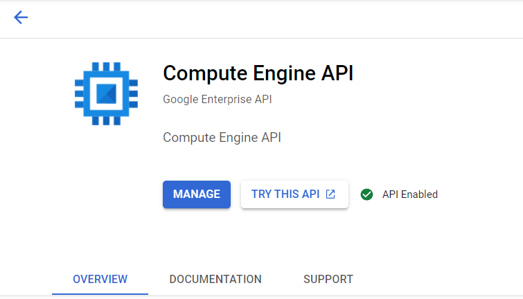

# Develop a CD Pipeline

In this exercise you will develop a CD pipeline that will build a Docker image from a Dockerfile and push it to a Docker registry in GCP. Then you will use this image to deploy a virtual machine that will execute de Kedro pipeline every 5 minutes.

## Objectives

- Build a Kedro Docker image
- Run and verify the image locally
- Add a container building step to the DevOps pipeline
- Add a container publish step to the DevOps pipeline
- Declare infrastructure as code (IaaC) using Terraform
- Declare infrastructure parameters
- Create a service account with IAM permissions for deployment
- Add a deployment step to the DevOps pipeline

## Prerequisites

If you intend to replicate this exercise as it is, I encourage you to [fork](https://docs.github.com/en/get-started/quickstart/fork-a-repo) this repo to your account.

It is necessary that you have [Docker](https://docs.docker.com/engine/install/) installed in your device and that you have a [GCP account](https://cloud.google.com/).

To develop this exercise you should have done the [setup steps in the README.md](../../README.md). It is also advisable that you do the [first exercise](ci_pipeline.md) before beginning this exercise so you may have more clarity about the DevOps pipeline structure. To begin, you must **checkout to the exercise branch named** `exercises/02-cd-pipeline` using

```
git checkout exercises/02-cd-pipeline
```

## Exercise 1: Build and publish a Kedro Docker image

### 1.1: Change Application logic

Add the following catalogs to your `conf/base/catalog.yml` file

```yaml
pokeapi:
  type: api.APIDataSet
  url: https://pokeapi.co/api/v2/pokemon
  params:
    limit: 100000
    offset: 0
    format: json

pokemons:
  type: pandas.ParquetDataSet
  filepath: data/01_raw/pokemons.parquet
```

Then add the following code to your `src/kedro_devops/pipelines/data_engineering/nodes/transform_uppercase.py` file

```python
import pandas as pd
from requests import Response


def transform_uppercase(data_set: Response) -> pd.DataFrame:
    """
    Transform a lowercase dataframe to uppercase.

    Args:
        data_set (APIDataSet): A raw api request

    Returns:
        pd.DataFrame: An uppercase dataframe
    """
    json_data = data_set.json()
    pokemons = json_data.get("results")
    data = pd.json_normalize(pokemons)
    return data.applymap(lambda x: x.upper())

```

This will process the [pokemon api](https://pokeapi.co/) data and transform it to uppercase. After this, we need to add a node to our pipeline that uses the modified `transform_uppercase` function and the catalogs that we added to the `conf/base/catalog.yml` file. To do this we need to open the `src/kedro_devops/pipelines/data_engineering/pipeline.py` file and add the following code:

```python
...
def create_pipeline(**kwargs) -> Pipeline:
    """
    Create a pipeline for data engineering.

    Returns:
        Pipeline: the data engineering pipeline.
    """
    return Pipeline([
        Node(
            transform_uppercase,
            inputs="pokeapi",
            outputs="pokemons",
            name="pokemons_uppercase")
    ])
```

Since the logic of our application has changed, the current test are no longer valid, you can verify this by running `kedro test`. Hence, we need to add the following tests to our `src/tests/pipelines/data_engineering/nodes/test_transform_uppercase.py` file:

```python
...

class TestTransformUppercase:
    def test_transform_string(self, monkeypatch: MonkeyPatch):
        """
        should return a upper case string for a string dataframe
        """

        def mock_json():
            return {
                "results": [{"data": "test1"}, {"data": "test2"}, {"data": "test3"}]
            }

        t_dataframe = Response()
        monkeypatch.setattr(t_dataframe, "json", mock_json)

        output = transform_uppercase(t_dataframe)

        assert output.equals(pd.DataFrame({"data": ["TEST1", "TEST2", "TEST3"]}))

```

This test will mock the response that we get from the API and check if the dataframe is equal to the expected one.

### 1.2: Configure Requirements

Now that we have our pipeline, we need to add the following dependency to `src/requirements.in` to allow us to build and run the image locally.

```properties
...
kedro-docker
...
```

Then build and install the requirements using:

```bash
kedro build-reqs
pip install -r src/requirements.txt
```

### 1.3: Generate a Dockerfile

Generate a `Dockerfile` using the following command:

```bash
kedro docker init
```

Modify the `Dockerfile` in the root directory of the project to look like this

```dockerfile
# BUILD STAGE
FROM python:3.7-buster as builder
WORKDIR /home/kedro

# install project requirements
RUN pip install --no-cache-dir --upgrade pip
COPY ./src .

RUN pip install --no-cache-dir pip-tools && \
    pip-compile requirements.in --output-file requirements.txt && \
    python setup.py clean --all bdist_wheel


# RUN STAGE
FROM python:3.7-buster as runner

# install cron dependencies
RUN apt-get -y update && \
    apt-get -y upgrade && \
    apt-get install -y cron

# install build whl file
COPY --from=builder /home/kedro/dist/kedro_devops-0.1-py3-none-any.whl /tmp/kedro_devops-0.1-py3-none-any.whl
RUN pip install --no-cache-dir --upgrade pip && pip install --no-cache-dir /tmp/kedro_devops-0.1-py3-none-any.whl

# add kedro user
WORKDIR /home/kedro

# copy necessary files
COPY . .

# add execution permissions to execution script
RUN chmod +x executor.sh && touch conf/local/credentials.yml

# add cron job to run kedro every minute
RUN echo "* * * * * root bash /home/kedro/executor.sh >> /home/kedro/cron_logs.log 2>&1" >> /etc/crontab

# configure cron job log file
RUN touch /var/log/cron.log

# run the cron as entrypoint
CMD ["cron","-f"]

```

### 1.4: Building a Docker Image

Then build a container using the following command:

```bash
kedro docker build
```

### 1.5: Running a Docker Image Locally

After the container is built, we can run it locally using the Docker interface or by using the following command:

```bash
docker run -d --name kedro_devops kedro-devops
```

If you want to debug your running container you can do it from the Docker interface or by executing this command:

```bash
docker exec -it kedro_devops /bin/bash
```

### 1.6: Adding a Docker Build and Push Step in the Pipeline

Now that we verified that our container is up and running, we can add a step to our pipeline to build and push the container to our Docker registry. First we need to split our `.github/workflows/pipeline.yml` in two files: one to make CI for all branches except for `main` and another that makes CI and CD for our `main` branch. First we will rename the `.github/workflows/pipeline.yml` file to `.github/workflows/ci_pipeline.yml` and modify the content as follows:

```yaml
name: Continuous Integration Pipeline
on:
  push:
    branches:
      - "*"
      - "!main"
jobs:
  lint-project:
    runs-on: ubuntu-latest
    steps:
      - uses: actions/checkout@v2
      - uses: s-weigand/setup-conda@v1
        with:
          python-version: 3.7.9
      - name: Install pip-tools
        run: pip install pip-tools
      - name: Install dependencies
        run: |
          pip-compile src/requirements.in --output-file src/requirements.txt
          pip install -r src/requirements.txt
      - name: Run linting
        run: kedro lint

  test-project:
    runs-on: ubuntu-latest
    steps:
      - uses: actions/checkout@v2
      - uses: s-weigand/setup-conda@v1
        with:
          python-version: 3.7.9
      - name: Install pip-tools
        run: pip install pip-tools
      - name: Install dependencies
        run: |
          pip-compile src/requirements.in --output-file src/requirements.txt
          pip install -r src/requirements.txt
      - name: Run test
        run: kedro test
```

Note that we defined in the `push` clauses the branches that are going to trigger this pipeline. Now we are going to define our `.github/workflows/cd_pipeline.yml` file as follows:

```yaml
name: Continuous Delivery Pipeline
on:
  push:
    branches:
      - main
jobs:
  lint-project:
    runs-on: ubuntu-latest
    steps:
      - uses: actions/checkout@v2
      - uses: s-weigand/setup-conda@v1
        with:
          python-version: 3.7.9
      - name: Install pip-tools
        run: pip install pip-tools
      - name: Install dependencies
        run: |
          pip-compile src/requirements.in --output-file src/requirements.txt
          pip install -r src/requirements.txt
      - name: Run linting
        run: kedro lint

  test-project:
    runs-on: ubuntu-latest
    steps:
      - uses: actions/checkout@v2
      - uses: s-weigand/setup-conda@v1
        with:
          python-version: 3.7.9
      - name: Install pip-tools
        run: pip install pip-tools
      - name: Install dependencies
        run: |
          pip-compile src/requirements.in --output-file src/requirements.txt
          pip install -r src/requirements.txt
      - name: Run test
        run: kedro test

  build-and-push-container:
    runs-on: ubuntu-latest
    needs: [lint-project, test-project]
    steps:
      - uses: actions/checkout@v2
      - uses: google-github-actions/setup-gcloud@master
      - uses: RafikFarhad/push-to-gcr-github-action@v4
        with:
          gcloud_service_key: ${{ secrets.GCLOUD_SERVICE_KEY }}
          registry: us.gcr.io
          project_id: sumz-laboratorios
          image_name: kedro-devops
```

The `build-and-push-container` step does the following:

1. Get the repository files from GitHub
2. Setup the `gcloud` client to access GCP in the command line
3. Build and push the container to the GCP registry using the `GCLOUD_SERVICE_KEY` secret, the us.gcr.io registry and the `sumz-laboratorios` project.

### 1.7: Creating and Adding a GCP Service Account Key

To create a service account key, you need to go to the [Google Cloud Console](https://console.cloud.google.com/iam-admin/serviceaccounts) and create a service account. After this, you can create a role with the following permissions and associate the role to the service account:


If you want to skip this step you can assign the `owner` role to the service account, nevertheless bear in mind that is a good practice to have a minimum privilege policy for your accounts.

Then you need to download the JSON key file and generate a base64 dump using:

```bash
python -m base64 my-account-key.json
```

Then you need to copy the output and add it to your repository secrets in GitHub.

### 1.8: Running the Pipeline

In order for the CD pipeline to run you need to be in the `main` branch and then you need to make a commit and a push to the repository. After this you may see the pipeline execution under the `actions` tab of your repository:


## Exercise 2: Define and deploy infrastructure as code (IaC) with Terraform

In this exercise we are going to deploy our Kedro pipeline to a GCE instance using Terraform and GitHub Actions. To work on the skeleton of this exercise you can clone or fork the repository and start working on the `exercises/03-cd-pipeline-terraform` branch.


### 2.1: Setting up Terraform

First you need to install [Terraform](https://www.terraform.io/downloads.html) in your device. For this exercise we are using `v1.0.8`. After this we are going to create the `terraform` folder in the root of our project and then we are going to create a `terraform/main.tf` file. In this file we are going to define the main Terraform configurations that will allow us to create the infrastructure in GCP. The content of the `terraform/main.tf` file are the following:

```properties
provider "google" {
  project     = "YOUR_GCP_PROJECT"
  region      = "us-east1"
  zone        = "us-east1-b"
  credentials = file("credentials.json")
}
```

Then we need to create a `terraform/credentials.json` file with our GCP service account key. This will allow us to connect our Terraform client with our GCP project. However, we don't want that any sensitive information is pushed to our repository, so we are going to add a `terraform/.gitignore` file that will prevent this:

```properties
credentials.json
# Local .terraform directories
**/.terraform/*

# .tfstate files
*.tfstate
*.tfstate.*

# Crash log files
crash.log

# Exclude all .tfvars files, which are likely to contain sentitive data, such as
# password, private keys, and other secrets. These should not be part of version
# control as they are data points which are potentially sensitive and subject
# to change depending on the environment.
#
*.tfvars

# Ignore override files as they are usually used to override resources locally and so
# are not checked in
override.tf
override.tf.json
*_override.tf
*_override.tf.json

# Include override files you do wish to add to version control using negated pattern
#
# !example_override.tf

# Include tfplan files to ignore the plan output of command: terraform plan -out=tfplan
# example: *tfplan*

# Ignore CLI configuration files
.terraformrc
terraform.rc

```

After this we are going to initialize Terraform with the required libraries to communicate with GCP. So inside the `terraform` directory execute:

```bash
terraform init
```

Terraform allows you to create different environments or **workspaces** to manage different code stages such as development and production. In this case we are going to create a custom workspace that is going to be named as you want.

```bash
terraform workspace new my-workspace
```

Now we are going to create our network file that is going to retrieve the necessary VPC and subnet information. The contents of the `terraform/network.tf` file are the following:

```properties
data "google_compute_network" "default" {
  name = "default"
}
```

This is going to retrieve the default VPC reference from GCP, for us to associate it to our new instance.

Now we are going to define our Terraform file that is going to create the instance. The contents of the `terraform/instance.tf` file are the following:

```properties
# Reference to the default compute engine service account. Replace the placeholder
# with the of the compute engine default service account that you find in
# https://console.cloud.google.com/iam-admin/serviceaccounts?project=YOUR_GCP_PROJECT
data "google_service_account" "default_compute_sa" {
  account_id = "DEFAULT_ACCOUNT_ID"
}

resource "google_compute_instance" "kedro" {
  name                      = "kedro"
  machine_type              = "e2-micro"
  allow_stopping_for_update = true

  # Defintion of disk specifications
  boot_disk {
    initialize_params {
      size  = 20
      # This type of image is specialized for containers and will help us run our 
      # kedro container
      image = "cos-cloud/cos-89-lts"
    }
  }

  network_interface {
    # Here we are referencing our network information from our network.tf file
    network = data.google_compute_network.default.name

    access_config {
    }
  }

  # The purpose of this script is to recreate the instance every time there are changes 
  # on our definition. It is a workaround to a synchronization issue that Terraform has 
  # with the GCP API.
  metadata_startup_script = <<EOT
  echo "Starting image ${var.docker_worker_image_digest}"
  EOT

  metadata = {
    # This multiline container declaration is structured as a Kubernetes YAML file.
    # The overall purpose is to create a single pod with the image we created and 
    # add a restart policy to respond to unexpected failures in the container.
    gce-container-declaration = <<EOT
    kind: Deployment
    metadata:
      name: kedro-pod
      labels:
        tier: kedro
    spec:
      containers:
        - name: kedro-service
          image: ${var.docker_worker_image_digest}
          stdin: false
          restartPolicy: Always
    EOT
  }

  # Here we are defining the service account that our instance will have in order
  # to access GCP APIs. By default, te instance will use the default compute service account
  service_account {
    # Google recommends custom service accounts that have cloud-platform scope 
    # and permissions granted via IAM Roles.
    email  = data.google_service_account.default_compute_sa.email
    scopes = ["cloud-platform"]
  }
}
```

Last, we need to specify a file that is going to be responsible to define the variables that Terraform is going to need to deploy the infrastructure. For now we only have the `docker_worker_image_digest` variable but in the future you can parametrize any variable you need such as secrets, IP addresses, etc. Now we are going to write a `terraform/variables.tf` file with the following content:

```properties
variable "docker_worker_image_digest" {
  type        = string
  description = "The digest of the image generated for the worker after being pushed into GCR"
}
```

Bear in mind that you can set default values for your variables in case you need them. 

### 2.2: Configure GCP Permissions

First we need to enable the GCE API for our project that can be done by entering to your GCP console and navigating to the APIs tab. Then search for the `Compute Engine` API and enable it. You can click in [this link](https://console.cloud.google.com/apis/library/compute.googleapis.com) to get directly to the GCE API permissions. Something like this should appear if the API has been enabled:



Add Compute Instance Admin (v1) role to service account
- Compute Instance Admin (v1)
Add devops service account as owner of the compute service account

### 2.3: Deploy the Infrastructure

To deploy our infrastructure, first we need to be sure that our Terraform configuration files are clean and valid, so we are going to execute:

```bash
# Format Terraform's configuration files
terraform fmt
# Validate Terraform's configuration files
terraform validate
```

Now we are going to review our deployment plan and apply the changes to GCP, but first recall that we need an input variable called `docker_worker_image_digest`, so we are going to define a new file `terraform/input.tfvars` that is going to store the digest of the image that we pushed GCR in the last exercise:

```properties
docker_worker_image_digest = "URL_TO_YOUR_IMAGE_DIGEST"
```
After this, everything is set up for us to deploy our infrastructure. Now lets execute:

```bash
# Expose Terraform's deployment plan that is going to be applied to GCP
terraform plan --var-file=input.tfvars

# Execute the deployment plan to GCP
# When prompted, accept the deployment execution
terraform apply --var-file=input.tfvars
```

When the deployment is done, you will see the VM running in GCE. If you want to check that the pipeline is up and running, you can ssh into the VM and then connect to the Docker container.

```bash
# Inside the GCE VM you can execute this commands

# List the running containers
docker ps

# Connect to the container
docker exec -it CONTAINER_NAME /bin/bash
```

### 2.4: Configure the Deployment in the Pipeline

Up to this point we have all the necessary configurations set to automate our CD workflow. Now what is left to do is to configure the deployment in the pipeline. For this we are going to add another step to the CD pipeline inside the `.github/workflows/cd_pipeline.yml` file as follows.

```yaml
  ...

  deploy-infrastructure:
    runs-on: ubuntu-latest
    needs: [build-and-push-container]
    steps:
      - uses: actions/checkout@v2
      - uses: hashicorp/setup-terraform@v1
        with:
          terraform_version: 1.0.8
          terraform_plugins: yes
      - name: Terraform Init
        working-directory: ./terraform
        run: terraform init
      - name: Terraform Validate
        run: terraform validate -no-color
      - name: Setup Terraform Parameters
        working-directory: ./terraform
        env:
          GCLOUD_SERVICE_KEY_RAW: ${{ secrets.GCLOUD_SERVICE_KEY_RAW }}
        run: |
          echo "${GCLOUD_SERVICE_KEY_RAW}" > credentials.json
          echo 'docker_worker_image_digest="us.gcr.io/sumz-laboratorios/kedro-devops"' > config.tfvars
      - name: Terraform Apply
        working-directory: ./terraform
        run: terraform apply -var-file="config.tfvars" -auto-approve
```

Now if you push the changes to GitHub, the pipeline will be executed and if all goes well, in the actions tab of you repository you will see the following:

