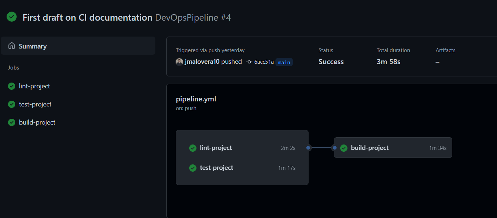

# Develop a CI Pipeline

In this exercise you will learn how to develop a CI pipeline that executes linting, testing, and building using GitHub actions. This will be done using a simple Kedro pipeline that transforms the data from a DataFrame to upper case.

## Objectives

- Configure a CI/CD provider
- Setup a linting stage
- Develop unit tests
- Setup a testing stage
- Setup a build stage
- Setup a pipeline to run all stages

## Prerequisites

If you intend to replicate this exercise as it is, I encourage you to [fork](https://docs.github.com/en/get-started/quickstart/fork-a-repo) this repo to your account.

To develop this exercise you should have done the [setup steps in the README.md](../../README.md). Then you must **checkout to the exercise branch named** `exercises/01-ci-pipeline` using

```bash
git checkout exercises/01-ci-pipeline
```

## Exercise

### Setting up GitHub actions

1. First you need to create the following folder structure under your root directory: `.github/workflows/pipeline.yml`. This is the file that GitHub actions is going to use to execute our pipeline.

2. Then you need to setup your `.github/workflows/pipeline.yml` file as follows:

   ```yaml
   name: DevOpsPipeline
   on: [push]
   ```

   This will give our pipeline the `DevOpsPipeline` name and will only execute if we make push to our repository independently of the branch we are on.

### Creating a linting step

Before creating our linting step lets open the `src/kedro_devops/cli.py` file. After you open the file, scroll down until you find the `lint` function which looks something like this:

```python
@cli.command()
def lint() -> None:
    """
    Linting function that makes static code analysis for the project
    when executing "kedro lint"
    """
    separator = "-" * 20

    print(f"{separator}\nRunning Black...\n{separator}")
    python_call("black", ["."])

    print(f"{separator}\nRunning isort...\n{separator}")
    python_call("isort", ["src/kedro_devops", "src/tests"])

    print(f"{separator}\nRunning flake8...\n{separator}")
    python_call("flake8", ["src/kedro_devops"])

    print(f"{separator}\nRunning pydocstyle...\n{separator}")
    python_call(
        "pydocstyle",
        ["src/kedro_devops/pipelines"],
    )

    print(f"{separator}\nRunning mypy...\n{separator}")
    python_call(
        "mypy",
        ["src/kedro_devops/pipelines", "src/tests"],
    )
```

This function creates a new Kedro cli command under the `kedro lint` name, which execute different [linters](<https://en.wikipedia.org/wiki/Lint_(software)>) that validate statically that our code is up to good practices and standards previously defined by the team. Take your time to investigate each of the linter tools in order to fully understand what they do.

- [black](https://pypi.org/project/black/)
- [isort](https://pypi.org/project/isort/)
- [flake8](https://pypi.org/project/flake8/)
- [pydocstyle](https://pypi.org/project/pydocstyle/)
- [mypy](https://pypi.org/project/mypy/)

Now we will implement this command in our pipeline to validate that our code is compliant with good practices.

1. Go to pipeline configuration file `.github/workflows/pipeline.yml` and under your previous declaration add the following:
   ```yaml
    name: DevOpsPipeline
    on: [push]
    jobs:
        lint-project:
            runs-on: ubuntu-latest
            steps:
            - uses: actions/checkout@v2
            - uses: s-weigand/setup-conda@v1
                with:
                python-version: 3.7.9
            - name: Install kedro
                run: pip install kedro==0.17.5
            - name: Install dependencies
                run: |
                kedro build-reqs
                pip install -r src/requirements.txt
            - name: Run linting
                run: kedro lint
   ```
   Lets analyze every line of our configuration
   - **jobs:** as its name suggests, under this clause we are going to list all the jobs that our pipeline is intended to do
   - **lint-project:** is the name of the job that is responsible for linting our code
   - **runs-on:** this clause specifies the type of machine in which our job is going to run. GitHub actions offer different OS such as Ubuntu, Windows and MacOS
   - **steps:** under this clause we define all the steps that our job is supposed to do
   - **uses:** is the import of an external step that is already defined in GitHub actions. In this case we are using the `checkout` step that is responsible for checking out the code from GitHub
   - **named steps:** these steps are in charge of doing the linting of our code. In this case we are using the `lint` step that is defined in the `src/kedro_devops/cli.py` file

### Creating unit tests

In this exercise we will create a unit test that will validate that our pipeline is working as expected. For this we are going to take a [TDD](https://en.wikipedia.org/wiki/Test-driven_development) approach in which we will create the test file before our actual code.

1. Create the `src/tests/pipelines/data_engineering/nodes/test_kedro_devops.py` file and add the following:

   ```python
    import pandas as pd

    class TestTransformUppercase:
        def test_transform_string(self):
            """
            should return a upper case string for a string dataframe
            """
            t_dataframe = pd.DataFrame({"names": ["foo", "bar", "baz"]})
            output = transform_uppercase(t_dataframe)
            assert output.equals(pd.DataFrame({"names": ["FOO", "BAR", "BAZ"]}))

   ```

   What this test validates is that the function `transform_uppercase` returns a dataframe with the same values as the input dataframe but with all the strings in upper case. If we execute `kedro test` the test is going to fail because we have not implemented the `transform_uppercase` function yet.

2. Create the `src/kedro_devops/pipelines/data_engineering/nodes/test_kedro_devops.py` file and add the following:

   ```python
    import pandas as pd


    def transform_uppercase(data: pd.DataFrame) -> pd.DataFrame:
        """
        Transform a lowercase dataframe to uppercase.

        Args:
            data (pd.DataFrame): A raw dataframe

        Returns:
            pd.DataFrame: An uppercase dataframe
        """
        return data.applymap(lambda x: x.upper())
   ```

3. Open the `src/tests/pipelines/data_engineering/nodes/test_kedro_devops.py` file and import the function as follows:

   ```python
   ...

    from src.tests.pipelines.data_engineering.nodes import test_kedro_devops

   ...
   ```

   Now if you run `kedro test` the test will pass because we have implemented the `transform_uppercase` function correctly.

### Creating a testing step

To create a testing step we will reuse some of the configurations that we have already done in the linting step.

1. Go to pipeline configuration file `.github/workflows/pipeline.yml` and under our previous declaration add the following:
   ```yaml
    name: DevOpsPipeline
    on: [push]
    jobs:
        ...
        test-project:
            runs-on: ubuntu-latest
            steps:
            - uses: actions/checkout@v2
            - uses: s-weigand/setup-conda@v1
                with:
                python-version: 3.7.9
            - name: Install kedro
                run: pip install kedro==0.17.5
            - name: Install dependencies
                run: |
                kedro build-reqs
                pip install -r src/requirements.txt
            - name: Run unit tests
                run: kedro test
   ```
   Now we have both a linting and testing stages in our pipeline.

### Creating a building step

To create a building step we will reuse some of the configurations that we have already done in the previous steps.

1. Go to pipeline configuration file `.github/workflows/pipeline.yml` and under our previous declaration add the following:
   ```yaml
    name: DevOpsPipeline
    on: [push]
    jobs:
        ...
        build-project:
            runs-on: ubuntu-latest
            needs: [lint-project, test-project]
            steps:
            - uses: actions/checkout@v2
            - uses: s-weigand/setup-conda@v1
                with:
                python-version: 3.7.9
            - name: Install kedro
                run: pip install kedro==0.17.5
            - name: Install dependencies
                run: |
                kedro build-reqs
                pip install -r src/requirements.txt
            - name: Build project
                run: kedro package
   ```
   The build step is almost the same compared as the previous step but has a `need` parameter that states that it depends on the linting and testing steps to execute. If either of them fails, the build step will not execute.

### Running the pipeline

Now your pipeline configuration file `.github/workflows/pipeline.yml` should look like this:

```yaml
name: DevOpsPipeline
on: [push]
jobs:
  lint-project:
    runs-on: ubuntu-latest
    steps:
      - uses: actions/checkout@v2
      - uses: s-weigand/setup-conda@v1
        with:
          python-version: 3.7.9
      - name: Install kedro
        run: pip install kedro==0.17.5
      - name: Install dependencies
        run: |
          kedro build-reqs
          pip install -r src/requirements.txt
      - name: Run linting
        run: kedro lint

  test-project:
    runs-on: ubuntu-latest
    steps:
      - uses: actions/checkout@v2
      - uses: s-weigand/setup-conda@v1
        with:
          python-version: 3.7.9
      - name: Install kedro
        run: pip install kedro==0.17.5
      - name: Install dependencies
        run: |
          kedro build-reqs
          pip install -r src/requirements.txt
      - name: Run test
        run: kedro test

  build-project:
    runs-on: ubuntu-latest
    needs: [lint-project, test-project]
    steps:
      - uses: actions/checkout@v2
      - uses: s-weigand/setup-conda@v1
        with:
          python-version: 3.7.9
      - name: Install kedro
        run: pip install kedro==0.17.5
      - name: Install dependencies
        run: |
          kedro build-reqs
          pip install -r src/requirements.txt
      - name: Run build
        run: kedro package
```

To execute our pipeline we will do the following:

1. Add your changes with `git add .`
2. Commit your changes with `git commit -m "Add pipeline"`
3. Push your changes with `git push` (easy isn't it?)

Now if we go to our repository page on GitHub and click on the `Actions` tab we will see the pipeline execution history. We can zoom into the execution we launched and we will see something like this:



> If your pipeline failed, try to see the logs of the job execution and debug your code in order to fix the issue.
